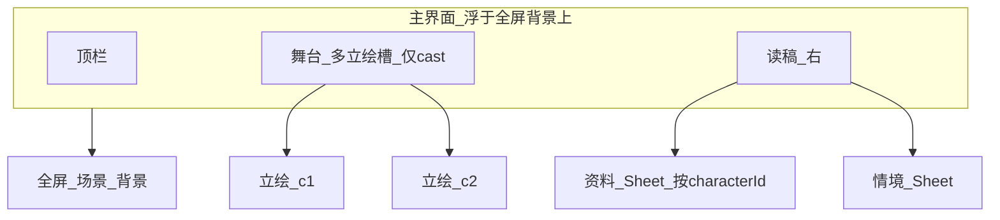

# 横版 AVG：沉浸宽屏 + 多人物分轨 + 与角色强绑定的状态/称号

**A+B1 可落地的文件级表见 [§7](#7-本次迭代可执行项--a--b1-本次能做的全部)。按依赖顺序的「实现总单」与细节见 [§8](#8-实现梳理b1-执行总单-注意细节)。** 后续 B2+ 见 §6.6。场景能力框架见 **§6.4**。

### 场景不仅是背景：须带「场景能力」——先搭**统一框架**再落各点

- **原则**：**不能**用「只保证商店 Tab」单点交差。不同地点/场景应声明自己允许的**能力**（affordances），**图书馆、咖啡店、商店、教室…** 各自不同；例：**商店**＝**购买**；**图书馆**＝阅览/学习/查资料等（具体玩法后填）；**咖啡店**＝点餐/小休/偶遇等（后填）。**本期优先**：搭**可扩展**的数据结构 + **一条 UI 承接入口** + **现网商店**接进框架；其它类型可先 **stub**（无操作或只提示「即将开放」），但框架位要留好。
- **与现网（商店作为第一个插件）**：[`shop_buy`](c:\Users\xiewr\Documents\MyA\src\app\api\game\action\route.ts)、资料 [`shop` Tab](c:\Users\xiewr\Documents\MyA\src\components\game\character-side-panel.tsx)、[`buildShopListingsUi`](c:\Users\xiewr\Documents\MyA\src\lib\game\content\shop-listings.ts) **不删**，改由「场景能力」注册表/渲染器**调用**，避免平行两套逻辑长期分叉（细节 **§6.4**）。
- **B1 必达**：（1）六 Tab 含 `shop` + `onShopBuy` 不断链；（2）**加** 框架位：`GameUiPayload` 增 **`sceneAffordances: string[]`（或枚举）** 与/或从 **当前 `world_travel_id` / `state.location` 查表** 得到能力列表，UI 用 **小横条/情境 Sheet 顶区** 按能力渲染**快捷入口**（至少能把 `shop` 挂上去；`library`/`cafe` 可空壳按钮或占位列）。
- **非目标（本期）**：把图书馆/咖啡店的**完整业务**做完；**目标**是**协议 + 注册/映射 + 一处 UI 挂载点**，各场景可迭代填肉。

## 0. 需求更新（与前期草图一致部分保留）

### 0.1 背景：宽屏、全屏沉浸

- 场景**背景层**占满视口（`100vw` × 视口高，可 `100dvh`），**不被 `max-w-7xl` 容器裁切**；主 UI 为浮层（顶栏/对话区/控制条），**背景在它们之下延伸**，增强「影院感/沉浸感」。
- 仍用**地点/场景**资源作底图，逻辑同下节「背景层」；**安全区**：可保留最底/最侧渐变避免与选项对比不足。

### 0.2～0.4 一景多人、出谁画谁、状态/称号与人物强关联（须扩协议+域，不是仅靠 CSS）

**产品规则**

- 同一**场景**内可出现**多名**角色；每名角色有**自己的**数值状态、称号进度等（与「单一全局 affection/trust」的现有 [`GameState`](c:\Users\xiewr\Documents\MyA\src\lib\game\domain\state.ts) 不同）。
- **展示规则**：**出现了谁，就只叠谁的立绘**（+ 始终显示该场景的大背景）。不在场的角色不显示其 CG 叠层，也不应在主栏展示其条（可收到「未出场 / 他处」的二级里若需要）。
- **强关联含义**：`CharacterSidePanel` 中的 **状态、称号** 在 UI 上须带 **当前聚焦角色**（chips/Tab/下拉/舞台点击头像等）；数据上须 **按 `characterId` 分桶**（或等价结构），与现有「陈悦单轨」解耦或迁移为「主角 id + 其他 id」的映射。

**工程分层（建议分阶段，避免单 PR 爆量）**

1. **协议**（`GameUiPayload` / 或拆子对象）：
   - `sceneBackgroundSrc` 或与现有一致的地点场景区块 URL（**整屏**）。
   - `cast: Array<{ characterId, displayName, portraitSrc, /** 可 slot / anchor */ position?, statsSnapshot, titleSummary? }>`  
     叙事/引擎按「本场出场名单」填充；`portraitSrc` 缺省 = 不叠该人图（但仍在列表中可选用于二级）。
2. **引擎与存档**：
   - 在 `state` 中从「单组四维」演进为 `perCharacter[characterId]`（或 `characters: CharacterState[]`），**迁移旧存档**（如默认 id=`chen_yue` 与旧字段对应）。
   - **称号/解锁**：`titleRows` 或同构结构带 `ownerCharacterId` 或分角色数组，避免全混在一个图鉴里。
3. **叙事/CG 管线**（可晚于 1+2 的最小可玩）：
   - 场记/故事标记**出场表** + 每人生成/选用 **portrait**（沿用现有 `cg_*.png` 或按 id 子目录），保证「**场景 + 出场者 CG**」可拼。
4. **UI**：
   - 全屏底图 + 前景 **1～N 个**立绘位（`absolute` 左/中/右或配置槽位），每人独立 crossfade 目标。
   - 「资料」里 **状态/称号** 在选中某出场角色时展示**该人**；若多人在场，**默认焦聚**为剧情当前说话对象或第一个出场位（可后续用叙事字段 `focusCharacterId` 定）。

**与当前代码的差距（执行前需认清）**

- 现服务端 [`toUiPayload`](c:\Users\xiewr\Documents\MyA\src\lib\game\server\game-response.ts) 仅一个 `cgImageSrc`、一人称数值；**实现本节的 0.2～0.4 需改 `state`、保存、称号与 UI 协议**，工作量大，建议拆 **「UI 多槽占位 + 单 cast 回退」→「真实多角色 state」** 两迭代。

**与 §6.0 对齐**：首包接受 **单角色**；装扮**按人**、手机**主角**、立绘 **UI 最多三槽** / 剧情 `>3` 人待定，见 **§6**。

---

## 1. 人物 CG 与背景分离

### 双图层（UI 上强制拆开）

| 层级 | 作用 | 数据来源（现状即可落地） |
|------|------|-------------------------|
| **背景层** | 全视口或舞台区的场景底图，独立 `object-fit: cover` / 可轻微渐变压暗，与人物层 **不是同一张整图** | 优先取当前地点的场景图：[`ui.world.locations`](c:\Users\xiewr\Documents\MyA\src\lib\game\content\world-locations.ts) 中 `current: true` 的条目的 `cgImageSrc`（`world_cg_src` 等，缺省时见回退） |
| **人物层** | 一名或多名立绘，叠在**全屏**背景上；每人独立 `img` 与淡入淡出 | 目标协议见 **§0.2** 的 `cast[]`；过渡阶段可仅传 **一人** 与现 `cgImageSrc` 对齐 |
| **回退** | 地点无 `cgImageSrc` | 纯渐变/深色 + 可能的一点模糊；不强行把 **人物** 立绘拉成全屏假背景 |

### 实现注记

- 现 [`CgCrossfadeImage`](c:\Users\xiewr\Documents\MyA\src\components\game\cg-crossfade-image.tsx) 可抽 **useCgCrossfade(src)**，复用到：全屏底图、**每个**立绘 slot。
- **多立绘位**：建议 `portrait` 组件接受 `slot` 或 `className`（左/中/右 预置 tailwind），避免 N 个图叠在同一 anchor。

## 2. 横板 + 对话在人物旁

- 大屏：浮层上 **左/中** 为 **全屏背景 + 1～N 立绘槽**；**右** 为对话卡片（或底栏在极窄屏）。多人时立绘**横向分槽**或 **前后层**（需立绘带透明底 PNG，否则仅左右分位）。
- 小屏：上=全宽背景+立绘、下=对话，或仅显示 `focus` 的一人立绘+「其他人在场」小头像条（计划可选）。

## 3. 二级面板

- 「资料」：原 `CharacterSidePanel` 多 Tab 迁入 Sheet（**含 地图 / 背包 / 商店 / 手机**等）。
- 「情境」：原 `GameWorldAside` 内时间条、chips、装扮、**下一时段/次日清晨** 等迁入 Sheet；推进操作易达。

**场景能力框架（可扩展，§6.4 详）**

- **统一点**：`sceneAffordances`（或据地点查表）驱动 **主界面/情境** 的**快捷带** + 资料内各 Tab/操作的**显隐**（商店只是 `shop` 一种 capability）。
- **例**：`shop` → 买；`library` → 后接「阅览」与 API；`cafe` → 后接「点单/小休」等。**B1** 可仅 **枚举 + UI 壳** + `shop` 实接，余者 **placeholder**。

## 4. 草图（布局确认用）

见下方 **分层示意**、**`lg+` 总览**、**Mermaid**；实现以你确认为准。

### 4.1 全屏层次（Z 序，自底向顶）

```text
  z=0   ███████████████████████████████████████  场景背景（整屏 100vw×高，object-fit: cover）
  z=1   ░░░ 横向渐变/暗角，保证前景可读 ░░░░░░░░░
  z=2       [立绘A]     [立绘B]   …              仅当 cast 含该角色时渲染；左/中/右槽
  z=3   ┌─ 顶栏：标题、操作、时间（可选透明底）───────┐
  z=4   │  [资料●]  [情境]   选角：[ A ✓ ] [ B ]  ← 状态/称号跟「当前选中/聚焦」走   │
  z=5         ┌ 读稿卡：剧情 / 内独白 / 风险 ┐
              │ 选项 1..4  · 自由输入         │
              └───────────────────────────┘
  z=6   ═══════ 控制台条（可收起，吸底）═══════════
```

### 4.2 横板总览（`lg+`）— 一屏看全

```text
  VIEWPORT
  +----------------------------------------------------------------------------+
  | z3  顶栏                                                                  |
  +----------------------------------------------------------------------------+
  |                                                                            |
  |  z0 背景  FULL BLEED  （教室/室外…整幅图铺满，左右可能被 crop）              |
  |  ·····································································     |
  |  ·  z2   [ 立绘：角色甲 ]   [ 立绘：角色乙 ]    z4,z5  ┌────────────────┐  |
  |  ·  （仅 cast 有谁画谁，独立槽）                  │ 剧情            │  |
  |  ·         ↑ 可点选切换「资料-状态/称号」归属      │ 内独白/风险     │  |
  |  ·                                            │ 选项2×2         │  |
  |  ·  z4  入口：[资料] [情境]  +  聚焦角色 chips   │ 自由输入         │  |
  |  ·                                            └────────────────┘  |
  |  z1 底缘渐变遮罩（可选，托住文字）                                         |
  +----------------------------------------------------------------------------+
  |  z6  控制台（固定底）                                                    |
  +----------------------------------------------------------------------------+
```

### 4.3 窄屏（`sm` 竖向）

```text
  +------------------+
  | 顶栏              |
  +------------------+
  | FULL 背景 + 立绘  |  ← 立绘可叠放或只显示 focus+头像条
  +------------------+
  | 读稿 + 选项 + 输入 |  ← 全宽
  +------------------+
  | 控制台            |
  +------------------+
```

## 5. 验证

改 `src/` 后：停默认端口 → `npm run start` → `npm run verify` 退出 0。

---

## 6. 方案全链路梳理与待补全项

### 6.0 产品决定（已确认）

1. **装扮与角色绑定**：不同角色有**独立**装扮数据（`TeacherWear` 类信息按 `characterId` 分桶）；实现顺序上可与多角色存盘同一步，但**需求已明确**。
2. **手机 = 主角设备**：`phoneThreads` 语义为**主角手机**——用于联系其他角色、或作为其他系统入口；**不是**「每人一部手机」；线程可关联对端 `characterId`（展示层用「谁发来的」即可）。
3. **同屏人数与 UI 槽位**：**场景**决定本段出场人数；**主界面立绘区最多 3 个槽**（左/中/右）。若叙事出场 `>3`：行为**留作后续讨论**（截断/轮播/只显 focus+缩略等），本阶段可优先保证 `cast.length ≤ 3` 的管线与 UI。
4. **首包可单角色**：接受 **先**按 **A + B1** 交付：全屏背景 + 单 `cast[0]`（复用现 `cgImageSrc` 与单轨 state），**不强制**首版上多角色存盘与多立绘；多角色、装扮分桶、称号分桶在 **B2+** 迭代。

### 6.1 从需求到数据流（目标态）

1. **场景与背景**：地点/章节点决定 `sceneBackgroundSrc`（全屏 `cover`）。与「谁在场」正交。
2. **出场 cast**：每回合或每段叙事由**引擎/标记**给出 `cast[]`（`characterId` + `portraitSrc` + 槽位/顺序可选）。**只画出场者**。
3. **聚焦 focus**：`focusCharacterId` 驱动「资料」里状态/称号查哪桶；可来自玩家点击、或叙事显式写出「当前说话人」。
4. **每角色状态/称号**：存档中按 `characterId` 分桶；`titleRows` 或 `unlocked_title_ids` 需能归属到角色；解锁逻辑在**应用 delta 时**知道加在谁身上。
5. **立绘资源**：每人的 `portraitSrc` 指向可公开 URL；生成管线可晚于结构，但路径规则要先定（子目录/命名）。

### 6.2 与现状对照（实现缺口）

| 域 | 现状 | 需补全 |
|----|------|--------|
| 存档/状态 | [`GameState`](c:\Users\xiewr\Documents\MyA\src\lib\game\domain\state.ts) 单轨 `affection` 等 + 单一 `unlocked_title_ids`；`SCHEMA_VERSION` 有迁移链 | 设计 `perCharacter`（或 `characters: []`）结构；`migrateSaveDict` 升 `SCHEMA_VERSION`，旧档映射到固定 `characterId`（如 `chen_yue`） |
| 称号 | [`titleRowsForUi`](c:\Users\xiewr\Documents\MyA\src\lib\game\domain\titles.ts) 全量表 + 全局已解锁 id | 题目定义带 `ownerCharacterId` 或分表；解锁数组按角色分或 `id` 内嵌角色前缀；UI 只展示**当前 focus** 的图鉴行 |
| 装扮 wear | 单套 `TeacherWear` 绑定陈悦语境 | **已定**：多角色时 **每角色独立装扮**；落库见 **§6.0-1**（B2 与结构改造一起做） |
| 世界/背包/手机 | [`WorldUiBlock`](c:\Users\xiewr\Documents\MyA\src\lib\game\content\world-ui-types.ts) 全局 | **已定**：**手机=主角**（联系他人/入口），线程侧可带对端 `characterId` 展示；地图/背包与世界层**仍可共享** |
| API 响应 | [`toUiPayload`](c:\Users\xiewr\Documents\MyA\src\lib\game\server\game-response.ts) 单 `cgImageSrc` | 显式 `sceneBackgroundSrc` + `cast[]` + `focusCharacterId?` + 每角快照；**首包 B1 可**仅单元素 + 单轨 state |
| CG 生成 | 引擎内单一路径 `cg_*.png` 序列 | 多角阶段：每 `characterId` 子资源或**静态**配角 + **主角**管线；`>3` 出场规则 **§6.0-3 待定** |
| 叙事/引擎 | 回合结果未内建「出场表」 | 从 `story-flags` / 场景表 / LLM 结构化**择一**产 `cast`；首包可**始终 1 人** |
| 上帝/调试 | `god_patch` 单组数值 | 扩展为按 `characterId` patch 或子表单（与 B2 同频） |
| UI | 单 `CgCrossfadeImage` 等 | 全屏底、**三槽上限** 立绘、Sheet、focus；首包 1 槽亦有 |

### 6.3 产品/设计：仍待讨论项

- **同屏 `cast.length > 3`（剧情允许，UI 只画 3 槽）**：只取前 3、按 `focus` 可轮换、小头像条、或**禁止叙事发 4+**——**未定**，与 **§6.0-3** 一致，延后才做。
- **无地点图时**：全屏渐变 / 低清模糊 / 与上一地点保持——**待定**（不影响首包 A+B1 搭壳）。
- **未出场角色**：主界面「资料」只看待遇 cast，还是**已解锁角色全体**可切换——**待定**。
- **剧情文本**：多人在场时说话人样式（名/色）——**可选**，非首包必达。
- **立绘三槽排布**：`cast.length` 1～3 时**左/中/右 弹性**（1 人偏左/中、2 人两槽等）**实现时**定细则即可。

### 6.4 场景与能力**框架**（商店/图书馆/咖啡店/… 同一套，禁止单点补丁）

| 点 | 说明 |
|----|------|
| **问题** | 单修「保留商店 Tab」会**堵死**图书馆、咖啡店等后续能力；须**一个扩展点**挂所有**场景型玩法**。 |
| **抽象** | **Capability id** 字符串或枚举，如：`shop` \| `library` \| `cafe` \| `classroom` \| `generic`；未来可加 `duel`/`pickup` 等。无业务逻辑时**不强造后端**，但 id 要稳定。 |
| **数据从哪来（优先序）** | **(1)** `config/scene/*.json`（或 `world_travel` 行）为每个地点增加 `scene_affordances: string[]`；**或 (2)** 维护 [`world_travel` 与能力映射表](c:\Users\xiewr\Documents\MyA\src\lib\game\content\world-travel-from-scenes.ts) 的兄弟模块 `scene-affordances.ts`：`(locationId \| world_travel_id) -> capabilities[]`；**或 (3)** `toUiPayload` 内用 `state.location` 查表。首包**最小**：静态 map 若干行（**商店/图书馆/咖啡** 三条示例）+ `default: []` 或 `['generic']`。 |
| **协议** | `GameUiPayload` 增 **`sceneAffordances: readonly string[]`**（**派生**字段、非存盘新真相源），与 `state.location` / 旅行点同步；可选附 **`sceneAffordanceMeta?: { id, label, hint? }[]`** 供 UI 展示中文名（「购买」「阅览」「小休」）。 |
| **UI 框架** | 单一组件，如 `SceneActionBar` 或**情境 Sheet 顶部**：**遍历** `sceneAffordances` → 为每个 id 用 **注册表** `registry[capId]` 决定渲染**按钮/入口**；`shop` → 打开带 shop Tab 的资料或内嵌**迷你购买条** + 仍接 `onShopBuy`；`library` / `cafe` → 首版可 **「占位」**（Toast/无操作）+ **aria-label** 标「即将开放」或**隐藏**到仅 dev。 |
| **现网商店** | **不旁路新建一套**：购买仍走 `shop` Tab + `shop_buy`；ActionBar 上 **「购买」= 调同一套**（`postAction` 或 `onPanel("shop")`+scroll）。 |
| **与场景切换** | `state.location` / 旅行后 **重新计算** `sceneAffordances`；**图书馆/咖啡店**与商店一样，**到地头**就应看到**对应**快捷（哪怕仅占位），而不是只有商店有特殊待遇。 |
| **B2+** | 为 `library`/`cafe` 加 **action**（新 `action: "library_..."`）前，先在**注册表**登记，不散落 if-else。 |

**B1 验收（框架向）**：

- [ ] 有 **`sceneAffordances`** 或**等价查表**在 `toUiPayload` 输出。
- [ ] 有 **单处 UI** 根据 `sceneAffordances` 渲染，且 **`shop` 能工作**；**`library`/`cafe` 在映射里**至少出现一种行为（显隐/占位/灰按钮）证明不是死的。
- [ ] 资料 Sheet 内 `shop` Tab 仍完整。

### 6.5 技术债与质量

- **预加载**：多 `portraitSrc` 同时变时的带宽与 `crossfade` 顺序（避免同时闪白）。
- **z-index/安全区**：全屏背景 + 顶栏 + 读稿 + 吸底控制台，与 `pb-game-console` 叠放一次算清。
- **可访问性**：二级 Sheet 焦点、Esc 关闭、`aria` 与读屏不破坏 hotkey。
- **性能**：`100vw` 大背景 + 多图，注意 `img` 尺寸与 `decoding`；避免整页重 mount。

### 6.6 建议交付切分（与 §0 / §6.0 呼应）

- **A + B1（首包，已接受单角色）**：全屏 `scene` 背景 + **单**立绘（或三槽但只亮一槽 = `cast[0]`）+ 读稿 + 二级 Sheet 壳子；`GameUiPayload` 可增 `sceneBackgroundSrc` / `cast` 但 **1 人**、**`GameState` 不改**；`cast[0].portraitSrc` ← 现 `cgImageSrc`。
- **B2**：`GameState` 多角色 + 装扮**按人** + 称号**按人** + 迁移 + `god_patch`；UI 三槽、**`cast`≤3 约束** 与 `focus`。
- **B3+**：`cast>3` 的叙事/表现策略、CG 多线、**§6.3 余项**。

## 7. 本次迭代可执行项（= A + B1，**本次能做的全部**）

范围：**不改** `GameState`、不做存档迁移、不做多角分桶、不改称号/装扮数据结构；**要做** 沉浸布局、双图层、协议扩展、二级面板壳、**手机文案** 与**立绘三槽 UI 占位**（可只亮 0～1 槽）、验证闭环。

**明确不在本次**：§6.6 之 **B2**（`perCharacter`、装扮/称号分桶、god 分角）、**B3+**、叙事引擎自动填多 `cast`。

---

### 7.1 类型与 API（`GameUiResponse` 扩展，向后兼容）

| 工作项 | 说明 |
|--------|------|
| 在 [`game-response.ts`](c:\Users\xiewr\Documents\MyA\src\lib\game\server\game-response.ts) 的 `GameUiPayload` 增加**可选/必填**（实现时定，建议全可选先）：`sceneBackgroundSrc: string \| null`、`cast: Array<{ characterId, displayName, portraitSrc, slot?: "left" \| "center" \| "right" }>`、`focusCharacterId?: string`、**`sceneAffordances: readonly string[]`（+ 可选 `sceneAffordanceMeta`）** | `sceneBackgroundSrc`：由 `buildWorldUiBlock` 结果中取 **`locations.find(l => l.current)?.cgImageSrc`**，无则 `null` 交 UI 走渐变回退。**`sceneAffordances`**：在 `toUiPayload` 内**按 `state.location` / 地点 id 查表**（见 **§6.4**），至少为**商店/图书馆/咖啡**准备映射行；无匹配则 `[]` 或 `['generic']`。 |
| `toUiPayload` 内**合成** | `cast` **长度 1**：`characterId` 用常量如 `defaultProtagonistId`（`chen_yue` 与 §6.2 迁移预留一致）、`displayName` 可固定或来自现有 copy、`portraitSrc` = 现有 `cgImageSrc` 推导结果；`focusCharacterId` 同 `cast[0].characterId` 可省略。保留 **`cgImageSrc` / `cgPendingPath` 不删**（同值写入，利旧消费方）。 |
| 导出/同步 | 所有引用 `emptyPayload` 处：[`GameClient.tsx`](c:\Users\xiewr\Documents\MyA\src\components\game\GameClient.tsx)、`game-reading-column` 若有类型导入、**若有** 测试/脚本 构造假 payload。 |
| API 边界 | [`/api/game/state`](c:\Users\xiewr\Documents\MyA\src\app\api\game\state)、[`action`](c:\Users\xiewr\Documents\MyA\src\app\api\game\action) 经 `toUiPayload` 即自动带新字段，一般**无需**单独改 route。 |

---

### 7.2 视觉：全屏背景 + 立绘分轨

| 工作项 | 说明 |
|--------|------|
| **背景** | 最底层 `fixed`/`absolute` `inset-0` 容器，`` 与现有一致，**`object-cover object-center` min-h-100dvh w-full**；无 `sceneBackgroundSrc` 时用 **CSS 渐变/深色**（在 [`globals.css`](c:\Users\xiewr\Documents\MyA\src\app\globals.css) 或 tailwind 工具类）勿留死白。 |
| **立绘** | 独立层叠在背景上（**不用** 人物图当全屏底）；`cast[0].portraitSrc` + pending 时保留上一张逻辑，与现 [`cg-crossfade-image.tsx`](c:\Users\xiewr\Documents\MyA\src\components\game\cg-crossfade-image.tsx) 行为一致；**抽** `useCgCrossfade`（或子组件 `CgImageCrossfade`）被背景与立绘**复用**为可选。 |
| **三槽占位** | 新组件如 `PortraitStage`：三格 **grid/flex**（左/中/右），B1 仅**填充一格**；空槽不撑死空白（实现择一，计划要求「结构上存在三槽」便于 B2）。 |
| **scrim** | 覆盖在背景上的横向/底部渐变 `pointer-events-none`，使右侧/底部读稿区对比度够（见 §4.1 z1）。 |
| **z-index 约定** | 在代码注释或 `globals` 中固定：背景 0、scrim 1、立绘 2、主浮层 10+、顶栏 20+、Sheet 50+、控制台 40 保持现有。 |

---

### 7.3 布局：横板分栏 + 小屏

| 工作项 | 说明 |
|--------|------|
| [`GameClient.tsx`](c:\Users\xiewr\Documents\MyA\src\components\game\GameClient.tsx) 游戏 Tab 根 | 移出 **`max-w-7xl mx-auto` 对整页的包裹** 于「舞台」；或仅 **顶栏/设置** 用窄容器、**主游戏** 用 `w-full` 全宽。`statusMsg` 条位置与可读性。 |
| 新结构（建议） | `GameViewport` 或行内：`(BackgroundLayer) + (Foreground: flex)`：`flex-1` **左/中** = 舞台区（`PortraitStage` 叠在含 scrim 的相对层上）+ **右** = 读稿列；`lg+` 横分；`max-lg` **列布局**：上=舞台+立绘、下=读稿（§4.3）。 |
| [`GameReadingColumn`](c:\Users\xiewr\Documents\MyA\src\components\game\game-reading-column.tsx) | 去掉/迁走「顶栏式」常驻 `CharacterSidePanel`；读稿+选项+自由输入 仍在主列；**加** 入口按钮「资料」「情境」打开 Sheet（或父级浮条）。`story-html` **max-h** 用 `min()` 随屏高重算。 |
| **移除/收缩** [`GameWorldAside`](c:\Users\xiewr\Documents\MyA\src\components\game\game-world-aside.tsx) | 主 grid **不再** 左右大双栏 + aside；内容迁 **情境 Sheet**（`SceneTimeStrip`、`ContextChips`、`WearHighlightBlock`、**下一时段/次日清晨**）。同文件**导出**或拆 `world-context-panel.tsx` 给 Sheet 复用。 |

---

### 7.4 二级面板

| 工作项 | 说明 |
|--------|------|
| 新 `GameSecondarySheet` | `open`、`onClose`、`title`、children；**Esc** 关、**点遮罩**关、**`aria-modal`**、打开时 `focus` 到面板内第一个可 tab 元素。 |
| **资料** | 内嵌现有 [`CharacterSidePanel`](c:\Users\xiewr\Documents\MyA\src\components\game\character-side-panel.tsx)（**六 Tab：含 stats/titles/map/bag/shop/phone**）；`onShopBuy` 仍接 `postAction(shop_buy)`；B1 **无**多角 focus；**手机** 加主角说明（§6.0-2）。 |
| **情境** | 嵌入原 aside 各块 + 两按钮。 |
| **场景能力条（框架）** | 新 `SceneActionBar`（名可改）：`sceneAffordances` + 注册表，**`shop` 实接**资料/购买，**`library`/`cafe` 等占位**；可放在**主舞台下沿**或**情境 Sheet 内容顶**；与 **§6.4** 验收一致。 |
| 父状态 | `charSheetOpen`、`contextSheetOpen` 或 `sheet: "none" \| "char" \| "context"`。 |

---

### 7.5 热键、控制台、设置页

| 工作项 | 说明 |
|--------|------|
| [`useChoiceHotkeys`](c:\Users\xiewr\Documents\MyA\src\components\game\use-choice-hotkeys.ts) | Sheet 打开时与 1–4 键冲突与否二选一，建议与现网一致。 |
| [`pb-game-console`](c:\Users\xiewr\Documents\MyA\src\app\globals.css) | 全屏后**复查** 主区底部与 `max-lg`/`lg+` 留白。 |
| **设置** Tab | 可**不** 使用游戏同底图，避免布局回归。 |

---

### 7.6 回退与边界（本次须处理）

- `sceneBackgroundSrc` 为 `null` / `cast` 异常：不崩；B1 保证 `cgImageSrc` 与 `cast[0].portraitSrc` **同路**。
- `cgPendingPath`：**「新 CG 生成中」** 迁至浮条或情境 Sheet 顶。
- `status` 与设置页 **z-index** 低于 Sheet、高于主内容（见 7.2 约定）。

---

### 7.7 工程闭环

- 依 [`.cursor/rules/mya-game-restart-service.mdc`](c:\Users\xiewr\Documents\MyA\.cursor\rules\mya-game-restart-service.mdc)：**停端口** → `npm run start`。
- `npm run verify` 退出 **0**。

### Todos（与 §7 对勾，执行时填）

- [x] **7.1** `GameUiPayload` + `toUiPayload` + `emptyPayload`（**含** `sceneAffordances` 与地点→能力**查表**）
- [x] **7.2** 全屏底、scrim、`PortraitStage` 单员、`useCgCrossfade` 抽
- [x] **7.3** `GameClient` 全宽、`GameReadingColumn`、下屏 aside
- [x] **7.4** `GameSecondarySheet`、资料/情境、手机；**`SceneActionBar` + 能力注册表**（`shop` 真、`library`/`cafe` 至少占位，**§6.4**）
- [x] **7.5** 热键/控制台/设置
- [x] **7.6** 回退与 pending 条
- [x] **7.7** 重启 + `verify`
- B2 / B3+ 见 §6.6，不列入

---

## 8. 实现梳理（B1 执行总单，**注意细节**）

本节**不重述** B2+，只把 **A+B1** 拆成**可按序开工**的流水线，并标出易错点（键、同值、顺序）。

### 8.0 硬边界

| 项 | 要求 |
|----|------|
| 域模型 | **不动** `GameState`、**不做** 存档 `SCHEMA` 升版、**不改** 称号/装扮存储结构。 |
| 单角色 | `cast` **只发 1 条**；`portraitSrc` 与 `cgImageSrc` **同 URL**；`cast[0].characterId` 用常量，与 B2 预留一致。 |
| 兼容 | 旧消费方只认 `cgImageSrc` 时仍可用；新字段**不得**要求客户端必填解析（`emptyPayload` 要完整默认）。 |
| 闭环 | 见 **7.7**；`npm run verify` 必须 0。 |

### 8.1 数据流（一次响应里谁先谁后）

1. 引擎/存档不变 → `toUiPayload` 入参仍是 `NarrativeEngine` + 上次响应。
2. **`buildWorldUiBlock(state)`** 得 `world`（`locations` 行带 `current`、`cgImageSrc` 等）——**背景**、旅行相关不变。
3. **地点关键**：[`state.location`](c:\Users\xiewr\Documents\MyA\src\lib\game\domain\state.ts) 为**中文字符串**（如「放学后的教室」）；[`buildWorldUiBlock`](c:\Users\xiewr\Documents\MyA\src\lib\game\content\world-locations.ts) 用 `def.label === state.location` 定 `current`。**`sceneAffordances` 查表键** 建议用 **`locations.find((l) => l.current)?.id`（`world_travel_id`）**，缺失时再 **fallback 用 `state.location` 作 key**，避免**纯中文字符串**散布逻辑内未集中；若 B1 只上静态表，在 **`scene-affordances.ts`（新文件）** 中**只维护一份** `Record<string, string[]>` 或两阶段查找函数。
4. `sceneBackgroundSrc` ← **`world.locations.find((l) => l.current)?.cgImageSrc ?? null`**（与 UI 用 `world` 自算**二选一**，计划建议 **在 payload 显式一份** 省客户端重复推）。
5. `cast[0]` ← `portraitSrc: cgImageSrc`（同源），`displayName` 固定文案如「陈悦」亦可。
6. `sceneAffordances` ← 纯函数 `resolveSceneAffordances(state, world 或 label/id)`，**不写入存档**。

### 8.2 推荐实现顺序（依赖：前者未完成则后者易返工）

| 序 | 块 | 内容 |
|----|-----|------|
| 1 | **域/协议** | 新 `scene-affordances.ts`（或等效）：`id`/`label` → `string[]`；`GameUiPayload` 增加字段 + `toUiPayload` 填充 + **`emptyPayload` 默认** `sceneAffordances: []`、**`cast: []` 或单条默认** 与 `sceneBackgroundSrc: null`（与 §7.1 一致，避免 `undefined` 全客户端判空） |
| 2 | **Crossfade 抽取** | `useCgCrossfade` / 小组件，先单测「背景**无** max-h 裁切、立绘**有** 底部对齐/高度上限」两样式 variant |
| 3 | **舞台** | `PortraitStage`（三槽 + 只填左或中一格）+ `SceneActionBar`（注册表渲染 `shop`+占位）；`ui` 从 `GameClient` 下行传入 |
| 4 | **全屏根布局** | `GameClient`：背景层 + scrim + `fixed` 注意事项（**`position` 与 `transform` 新建 stacking context 不要断 z-index**） |
| 5 | **主列** | `GameReadingColumn`：去 sticky `CharacterSidePanel`，加「资料」「情境」+ **向下传** `onShopBuy` / 各 Tab 回调**不变** |
| 6 | **Sheet** | `GameSecondarySheet` + 内嵌 `CharacterSidePanel`（**手机** 加一句主角说明）+ 情境面板的 **pending 行**自 aside 来 |
| 7 | **收尾** | `GameWorldAside` 从**主 game 流**拿掉、**`pb-game-console`** 与**顶栏/状态条**的 z-index、**热键**与 Sheet 焦点、§7.6 边界跑一遍 |
| 8 | **验证** | 7.7 |

**说明**：`SceneActionBar` 放在 **4 与 5 之间**也可（依赖 `ui`），但须已有 **8.1 序 1** 的字段，否则用假数据先画 UI 会二次接线。

### 8.3 新字段默认值（`emptyPayload` 须一致，防 TS 与运行时双漏）

- `sceneBackgroundSrc`: `null`
- `sceneAffordances`: `[]`（**勿**用 `undefined`；若用 `as const` 注意只读与展开）
- `cast`: **B1 建议**始终长度 1，与**游戏未开始/placeholder** 时与 `cgImageSrc` 同为占位图 URL（见下 **8.4**）
- 可选 `sceneAffordanceMeta`：缺省时 UI 用注册表**内置中文 label**，避免硬编码散落

### 8.4 背景 / 人物 同事 **null/占位** 时

| 情况 | 行为 |
|------|------|
| `sceneBackgroundSrc === null` | 全屏 CSS 渐变（`globals` 或 Tailwind `from-slate-900 to-slate-950`），**禁止**白底闪屏。 |
| `cast[0].portraitSrc` 与 `cgImageSrc` | **同一来源**；若 `cg` 为 [`placeholderPublicPath()`](c:\Users\xiewr\Documents\MyA\src\lib\game\adapters\cg.ts) 行为，B1 保持与现网一致。 |
| `cast` 与 `emptyPayload` 首次渲染 | 若用 **空数组** 会在 UI 分叉，B1 推荐 **始终 1 元** 或舞台组件 **if length===0 则读 `cgImageSrc`** 单一回退，**只保留一条分支**以免双 bug。 |
| `cgPendingPath` | 在 **情境 Sheet** 或**舞台**顶条二选一、**不重复**两条相同文案。 |

### 8.4b `SceneActionBar` 与商店（不重复建购买）

| 点 | 要求 |
|----|------|
| 点击「购买」**推荐** | **B1 统一**为：打开**资料** Sheet 并切到 **`shop` Tab**（与仍使用 `ui.world.shopListings` 列表一致），**不** 另写第二套商品表。 |
| 与 `postAction(shop_buy)` 关系 | 购买动作仍从 **Shop Tab 行内**发起（与现 [`CharacterSidePanel`](c:\Users\xiewr\Documents\MyA\src\components\game\character-side-panel.tsx) 一致），ActionBar 只做**入口**；**禁止** ActionBar 上单独拼「无选择即 buy」 unless 产品后定。 |
| 占位 `library` / `cafe` | `disabled` + `title="即将开放"`，或**开发模式**下 `console.debug`；**避免** 正式服误点无反馈。 |

### 8.5 布局细节（`lg` / 窄屏 / 安全区）

| 点 | 注意 |
|----|------|
| 断点 | 与现网一致 `lg`（`1024px`）；**横板**用 `min-[1024px]:` 或 `lg:`，与 [`game-world-aside` 的 `useLgBreakpoint`](c:\Users\xiewr\Documents\MyA\src\components\game\game-world-aside.tsx) **避免两套断点**（可抽**共用** hook 到 `hooks/`）。 |
| 顶栏 / 全屏 | 全屏底图 `fixed inset-0` 时，主内容加 **`relative z-10`** 包裹，并给子级 **`pointer-events-auto`** 若父曾 `none`。 |
| iOS 安全区 | 控制台、底栏可继续用 `env(safe-area-inset-bottom)`（**勿**删现逻辑）。 |
| 读稿 `max-h` | `100dvh` 在移动端更稳；用 `min(100dvh-顶栏-控制台-…)` 时**在注释写公式**，避免调 CSS 时猜。 |

### 8.6 文件-任务对照（便于分 PR/分工）

| 文件/区域 | 改什么 |
|------------|--------|
| [`src/lib/game/server/game-response.ts`](c:\Users\xiewr\Documents\MyA\src\lib\game\server\game-response.ts) | 类型、合成、`toUiPayload`、导出类型 |
| **新** `src/lib/game/content/scene-affordances.ts` | `resolveSceneAffordances` + 常量 `DEFAULT_PROTAGONIST_ID`（可与 UI 共） |
| **新/拆** `cg-crossfade` 的 hook 与**背景/立绘** 变体 class |
| **新** `PortraitStage` / `SceneActionBar` / `GameSecondarySheet` |
| [`GameClient.tsx`](c:\Users\xiewr\Documents\MyA\src\components\game\GameClient.tsx) | 全屏壳、state、**所有** 回调**仍**传入子组件 |
| [`game-reading-column.tsx`](c:\Users\xiewr\Documents\MyA\src\components\game\game-reading-column.tsx) | 去侧栏、加按钮、**props 列表** 可能变长，注意不丢 `onShopBuy` 等（[`character-side-panel`](c:\Users\xiewr\Documents\MyA\src\components\game\character-side-panel.tsx) 已有 **shop** 参数） |
| [`game-world-aside.tsx`](c:\Users\xiewr\Documents\MyA\src\components\game\game-world-aside.tsx) 或 `world-context-panel` | 内容复用到情境 Sheet **纯展示**块 |
| [`globals.css`](c:\Users\xiewr\Documents\MyA\src\app\globals.css) | scrim、z-index 注释、必要时 `min-h-100dvh` 工具 |

### 8.7 不做的（防 scope creep）

- 不改 [`action` route](c:\Users\xiewr\Documents\MyA\src\app\api\game\action\route.ts) 的 **shop_buy** 语义，除非 bugfix。
- 不为 `library` 新增**持久化** flags（B1）。
- 不把**多 cast** 真实叙事接入（仅 UI 多槽**空着**或 1 人）。

---

## ASCII 草图（`lg+` 横板）

```text
┌─ 视口 (min-h-screen) ─────────────────────────────────────────┐
│  HEADER：标题  ·  开始/重开  ·  设置  ·  可选 一行 calendar    │
├─主舞台 (flex, 横分) ────────────────────┬─ 读稿区 ───────────┤
│  [资料]  [情境]  ← 顶角小入口（可选同排）  │  半透明卡片         │
│                                           │  ┌───────────────┐  │
│   ░░  LAYER0 地点背景  cover 全幅  ░░░     │  │ 剧情 (scroll) │  │
│   ░  ( world.current.cg )          ░      │  │ 内独白/风险   │  │
│   ░  + 底/侧 渐变 保证 对比  ░░░         │  └───────────────┘  │
│   [L1a 立绘] [L1b 立绘] ... (仅 cast 中出场者)  │  [ 选项1 ][ 选项2 ]  │
│   每轨独立淡入；槽位可左/中/右                    │  [ 选项3 ][ 选项4 ]  │
│                                          │  自由输入 ─────────  │
├──────────────────────────────────────┴──────────────────────┤
│  控制台 (固定底，可收合，pb-game-console)                      │
└────────────────────────────────────────────────────────────┘
```

**小屏 (`<lg`)**：上块 = 与上相同的「背景 + 人物」；下块 = 整宽对话/选项（竖向紧邻）。

## Mermaid（信息架构，含多角色）


