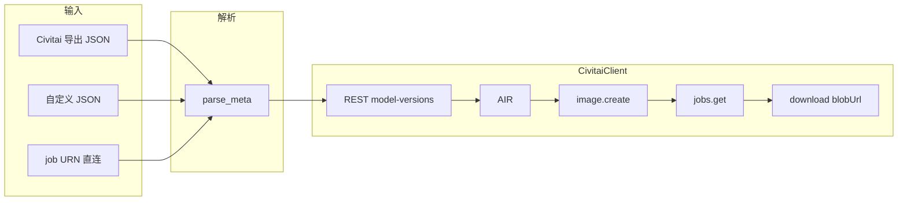

# MyA 本地 SDK 参考

**范围**：本仓库在 **`civitai-py`** 与 **Civitai REST v1** 上的封装；元数据 → `job_input` → 出图。官方行为以 [Developer Portal](https://developer.civitai.com/docs/api/python-sdk) 为准。

---

## 1. 依赖与环境

| 项 | 值 |
|----|-----|
| Python | 3.10+（`civitai-py` 最低 3.7+） |
| 安装 | `pip install civitai-py` |
| Token | `CIVITAI_API_TOKEN`，或项目根 **`sdk.token_file.DEFAULT_TOKEN_FILENAME`**（默认 `.key`，单行） |

包路径：**`sdk/`**。本地 token 文件名与路径由 **`sdk/token_file.py`** 统一定义；加载逻辑为 **`ensure_api_token()`**（`sdk/client.py`）。项目根在 `PYTHONPATH` 中或从项目根执行脚本时：

```python
from sdk import CivitaiClient, ensure_api_token, build_job_input, parse_meta, ParsedMeta
```

子模块：`sdk.client`、`sdk.meta_job`、`sdk.from_meta`（`build_job_input`）。

**`generate_from_meta.py`**：CLI 入口；逻辑在 **`sdk.from_meta`**。

**TypeScript 实现**（本目录）：`client.ts`、`meta-job.ts`、`from-meta.ts`、`token-file.ts`。单次出图 CLI（固化角色卡 + 英文场景，经游戏 `runCgJob`）：仓库根 `scripts/civitai-generate-scene.ts`，执行 `npx tsx scripts/civitai-generate-scene.ts`。

---

## 2. 数据流



| 模块 | 职责 |
|------|------|
| `sdk.meta_job` | 多形态 JSON → `ParsedMeta`（内层生成块或完整 `direct` 任务） |
| `sdk.client.CivitaiClient` | REST、URN 解析、`civitai.image.create`、`jobs.get` 轮询、下载 |
| `sdk.from_meta` | `build_job_input`、scheduler 归一化、CLI `main()` |

---

## 3. `CivitaiClient`（`sdk/client.py` / `client.ts`）

### 3.1 构造

```python
client = CivitaiClient(
    token=None,                    # 默认：环境变量 / `.key` 文件
    key_path=None,
    rest_base="https://civitai.com/api/v1",
    model_version_cache_dir=None,  # 离线 JSON 缓存目录，见 3.4
)
```

### 3.2 方法

| 方法 | 行为 |
|------|------|
| `rest_get_json(path, params=None)` | `GET` REST；`path` 如 `"/models/123"` |
| `get_model_version(model_version_id)` | `GET /model-versions/{id}`；若存在 `{id}.json` 缓存则只读文件 |
| `resolve_resource_urn(resource_type, model_version_id)` | 从版本响应取 `air` / `airUrn` / `urn`，否则拼装 URN |
| `create_image_job(job_input, wait=False)` | `civitai.image.create` |
| `poll_jobs_until_blob(token, timeout_sec=600, interval_sec=2.0)` | 轮询至出现可下载 `blobUrl` |
| `generate_image_and_wait(job_input, ...)` | 提交 + 轮询；返回 `(last_response, blob_url)` |
| `download_url(url, out_path)` | 保存图片 |

### 3.3 轮询与 `result`

- 提交：`wait=False` → `jobs.get(token=...)`
- `result`：`dict | list` 均处理；`blob_url_from_job` 抽取 `blobUrl` 及兼容字段

### 3.4 离线缓存

路径：`<model_version_cache_dir>/<id>.json`，内容为 `GET /api/v1/model-versions/<id>` 完整响应。

`get_model_version` / `resolve_resource_urn` 命中缓存时不发 HTTP 请求。

---

## 4. `parse_meta`（`sdk/meta_job.py` / `meta-job.ts`）

### 4.1 签名

`parse_meta(raw: dict, fmt: MetaFormat)`

**`fmt`**：`"auto"` | `"civitai"` | `"custom"` | `"direct"`

**`ParsedMeta`**：

| `kind` | 结构 |
|--------|------|
| `inner` | `prompt`、`negativePrompt`、`width`、`height`、`steps`、`cfgScale`、`sampler`/`scheduler`、`seed`、`clipSkip`、`civitaiResources` 等 |
| `direct_job` | 顶层 `model`（字符串）+ `params`；可选 `additionalNetworks` 等 |

**`auto` 判定顺序**：

| 序号 | 条件 | 分支 |
|------|------|------|
| 1 | 根级存在字符串 `model` 且对象 `params` | `direct` |
| 2 | 嵌套 `meta.meta` + prompt/resources 等 Civitai 导出特征 | `civitai` |
| 3 | 其余 | `custom` 扁平解析 |

### 4.2 输入形态

| 来源 | 结构特征 | 常用 `fmt` |
|------|----------|------------|
| Civitai 导出 | `meta.meta`、`civitaiResources` | `auto` / `civitai` |
| 手写参数 | 根级或 `generation` 下字段对齐内层 meta + `civitaiResources` | `custom` / `auto` |
| 已有完整任务 | 根级 `model` + `params`（与官方 SDK 一致） | `direct` |

示例（若仓库中存在）：[`examples/custom_meta.example.json`](../../../examples/custom_meta.example.json)、[`examples/direct_job.example.json`](../../../examples/direct_job.example.json)。

---

## 5. `build_job_input`（`sdk/from_meta.py` / `from-meta.ts`）

| 参数 | 作用 |
|------|------|
| `meta_format` | 同 `parse_meta` 的 `fmt` |
| `prompt_append` / `negative_append` | 追加正负向文本 |
| `seed_override` / `scheduler_override` | 覆盖种子、调度器（SDK 名，如 `EulerA`） |
| `max_side` | 默认 1024；宽高单边上限（`0` = 不缩放） |
| `lora_strength_default` | 资源未给 `strength` 时的默认值 |

- **`direct_job`**：`model`/`params` 上同样应用追加、覆盖、`width`/`height` clamp。
- **`inner`**：首个 **checkpoint** 资源 → 主 `model`；其余 → `additionalNetworks`；依赖 `resolve_resource_urn`（网络或 3.4 缓存）。

---

## 6. CLI：`generate_from_meta.py`

项目根：

```text
python generate_from_meta.py <元数据.json> [选项]
```

| 选项 | 含义 |
|------|------|
| `--format auto\|civitai\|custom\|direct` | 解析模式 |
| `--dry-run` | 只输出 `job_input` JSON，不提交 |
| `--out` | 输出文件路径 |
| `--prompt-append` / `--negative-append` | 追加提示词 |
| `--seed` / `--scheduler` | 覆盖 |
| `--max-side` | 单边上限（默认 1024） |
| `--model-version-cache` | 模型版本 JSON 目录 |
| `--timeout` / `--poll-interval` | 轮询超时与间隔（秒） |

---

## 7. 相对官方 SDK 的覆盖

| 区域 | 状态 |
|------|------|
| Token（env + `.key`）、`GET model-versions`（含文件缓存）、URN、`image.create`、轮询、下载 | 封装在 `CivitaiClient` / `from_meta` |
| `jobs.cancel`、`jobs.query`、`callbackUrl`、复杂 ControlNet | 未封装；`job_input` 为 dict，可直接按官网字段扩展后 `create_image_job` |

---

## 8. 故障与约束

| 现象 | 关联 |
|------|------|
| REST 403 / 网络失败 | Token、代理；`--model-version-cache` |
| 宽高校验错误 | `--max-side` 或改元数据分辨率 |
| 无 checkpoint | `civitaiResources` 至少一项 `type: checkpoint` + `modelVersionId`；或 `--format direct` + 手写 URN |
| URN 与底模不一致 | 优先用 REST 的 `air`/`urn`；`baseModel` 启发式可能覆盖不全 |

---

## 9. 相关文档

- [civitai_api.md](civitai_api.md)：REST v1、下载 API、`civitai-py` 字段与端点表
